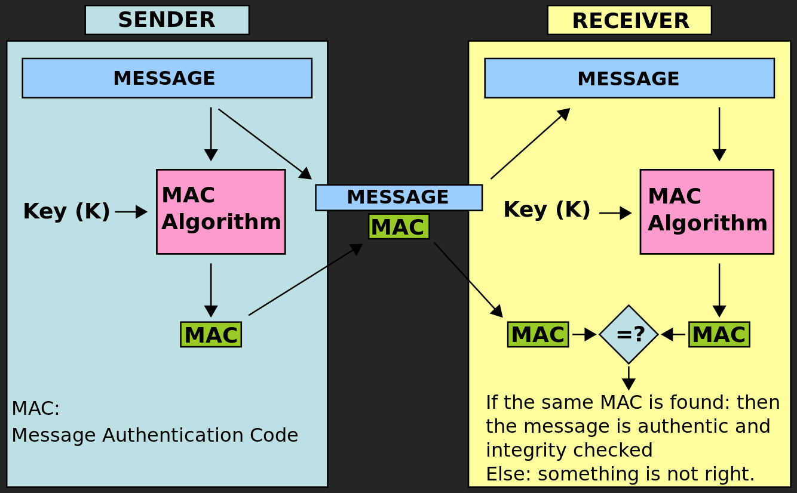

# Message Authentication Code (MAC)

  - Authenticate a message, in other words, to confirm that the message came from the stated sender and has not been changed.
  - It is similar to a message digest to calculate a hash, but uses a secret key so that only a person with the secret key can verify the authenticity of the message.
  
# Thinking

  - Generating a key
    - key generator
    - password
  - Generating the MAC
  - Combining the message and the MAC
    

# Coding

  ```java
  import javax.crypto.KeyGenerator;
  import javax.crypto.Mac;
  import javax.crypto.SecretKey;
  import javax.crypto.SecretKeyFactory;
  import javax.crypto.spec.PBEKeySpec;
  import javax.crypto.spec.SecretKeySpec;
  import java.io.*;
  import java.nio.charset.StandardCharsets;
  import java.security.InvalidKeyException;
  import java.security.NoSuchAlgorithmException;
  import java.security.SecureRandom;
  import java.security.spec.InvalidKeySpecException;
  import java.security.spec.KeySpec;
  import java.util.Base64;
  import java.util.Formatter;

  public class HmacSha1Signature {
      private static final String KEY_ALGORITHM = "AES"; // AES, ARCFOUR, BLOWFISH, DES, DESEDE, HMACMD5, HMACSHA1, HMACSHA224, HMACSHA256, HMACSHA384, HMACSHA512, RC2
      private static final String HMAC_SHA256_ALGORITHM = "HMACSHA256"; // HMACMD5, HMACSHA1, HMACSHA224, HMACSHA256, HMACSHA384, HMACSHA512
      private static final String FILE_PATH = "/Users/Poppingary/Documents/HiTRUST_workspace/HMAC-SHA1 Signatures/Key/key.txt";

      // Step 1: generating the key
      // approach 1: key generator
      private static byte[] generateKeyByKeyGenerator() throws NoSuchAlgorithmException {
          KeyGenerator kgen = KeyGenerator.getInstance(KEY_ALGORITHM);
          SecretKey key = kgen.generateKey();

          return key.getEncoded();
      }

      // approach 2: password
      private static byte[] generateKeyByPassword() throws NoSuchAlgorithmException, InvalidKeySpecException {
          Base64.Encoder encoder = Base64.getEncoder();
          SecureRandom srandom = new SecureRandom();
          byte[] salt = new byte[8];
          srandom.nextBytes(salt);
          System.out.println("Salt: " + encoder.encodeToString(salt));

          char[] password = "secret".toCharArray();
          System.out.print("Password: ");
          for (Character word : password) {
              System.out.print(word);
          }
          System.out.println();

          SecretKeyFactory factory = SecretKeyFactory.getInstance("PBKDF2WITHHMACSHA256"); // PBKDF2WITHHMACSHA1, PBKDF2WITHHMACSHA224, PBKDF2WITHHMACSHA256, PBKDF2WITHHMACSHA384, PBKDF2WITHHMACSHA512
          KeySpec spec = new PBEKeySpec(password, salt, 10000, 128);
          SecretKey key = factory.generateSecret(spec);

          return key.getEncoded();
      }

      // saving the key into a file
      private static void saveKeyIntoFile(byte[] key) throws IOException {
          File file = new File(FILE_PATH);
          FileOutputStream fileOutputStream = new FileOutputStream(file);
          OutputStreamWriter outputStreamWriter = new OutputStreamWriter(fileOutputStream, StandardCharsets.UTF_8);
          BufferedWriter bufferedWriter = null;

          if (!file.exists()) {
              file.createNewFile();
          }

          try {
              bufferedWriter = new BufferedWriter(outputStreamWriter);

              StringBuilder keyString = new StringBuilder();

              for (Byte num : key) {
                  keyString.append(num);
              }

              bufferedWriter.write(keyString.toString());
          } catch (IOException e) {
              e.printStackTrace();
          } finally {
              if (bufferedWriter != null) {
                  bufferedWriter.close();
              }
          }
      }

      // getting the key from a file
      private static byte[] getKeyFromFile() throws IOException {
          StringBuilder keyString = new StringBuilder();
          File file = new File(FILE_PATH);
          FileInputStream fileOutputStream = new FileInputStream(file);
          InputStreamReader inputStreamReader = new InputStreamReader(fileOutputStream, StandardCharsets.UTF_8);
          BufferedReader bufferedReader = null;

          try {
              bufferedReader = new BufferedReader(inputStreamReader);

              String contentLine = bufferedReader.readLine();
              while (contentLine != null) {
                  keyString.append(contentLine);
                  contentLine = bufferedReader.readLine();
              }
          } catch (FileNotFoundException e) {
              e.printStackTrace();
          } catch (IOException e) {
              e.printStackTrace();
          } finally {
              if (bufferedReader != null) {
                  bufferedReader.close();
              }
          }

          System.out.println("Get the key from the file: " + keyString.toString());
          return keyString.toString().getBytes(StandardCharsets.UTF_8);
      }

      // generating the Message Authentication Code (MAC)
      private static byte[] generateMac(String message, byte[] key) throws NoSuchAlgorithmException, InvalidKeyException, UnsupportedEncodingException {
          SecretKeySpec signingKey = new SecretKeySpec(key, HMAC_SHA256_ALGORITHM);
          Mac mac = Mac.getInstance(HMAC_SHA256_ALGORITHM);
          mac.init(signingKey);

          return mac.doFinal(message.getBytes(StandardCharsets.UTF_8));
      }

      private static String toHexString(byte[] bytes) {
          Formatter formatter = new Formatter();

          for (byte b : bytes) {
              formatter.format("%02x", b);
          }

          return formatter.toString();
      }

      // combining the message and the MAC
      private static String combineMessageAndMac(String message, String mac) {
          return message + mac;
      }

      public static void main(String[] args) throws Exception {
          byte[] key = generateKeyByPassword();
          System.out.print("Key: ");
          for (Byte num : key) {
              System.out.print(num);
          }
          System.out.println();

          saveKeyIntoFile(key);
          byte[] keyFromTheFile = getKeyFromFile();
          String message = "Hello World!";
          String hmac = toHexString(generateMac(message, keyFromTheFile));

          System.out.print("Message + MAC: ");
          System.out.print(combineMessageAndMac(message, hmac));
      }
  }
  ```
